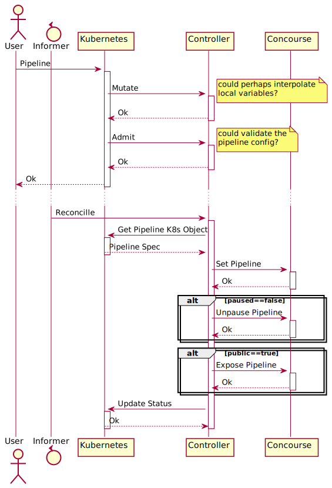

RFC: pipeline custom resource definition

# Summary

In a world where Concourse is part of a suite of other applications in
[Kubernetes] which all speak "the kubernetes language" (are somehow setup
through the use of Kubernetes objects), e.g. [kpack], having Concourse also
speaking that language might bring great opportunities for making it easier for
users and operators (as well as tools) to use / manage it.

With the use of [custom resources] we can bring to those "kubernetes speakers"
Concourse constructs that makes it a more native citizen in the "ecosystem".

```
  USER 
        (authorized for `concourse` namespace)

        kubectl --namespace concourse \
          apply -f <(echo 'kind: Pipeline...')

            => creates pipeline obj


  CONCOURSE

        reconciliates

          applies that pipeline definition against concourse's
          api

          <= gives the feedback through status updates in
             the pipeline obj
```

**This RFC proposes the implementation of a `pipelines` custom resource
definition having a controller that could act upon a `Pipeline` kind to save a
pipeline configuration in a Concourse installation.**


ps.: proof-of-concept based on @jchesterpivotal's prior work:
https://github.com/cirocosta/concourse-crds


# What this is *not* about

This proposal DOES NOT try encompass:

- deployment of Concourse in a Kubernetes environment: while it's true that we
  could go with the [operator pattern] to get Concourse deployment (where we
  could define a `Concourse` resource with a [controller] watching for an creating
  `concourse web` [pods] and a `postgres` database), that's not in the scope of
  this proposal.


- the runtime aspect of Concourse - going from a [build] plan to steps that at
  some point run as pods in a Kubernetes cluster is in the realm of [rfc: how do
  we best leverage k8s as a runtime] and [k8s-based implementation of atc's
  worker iface] instead.


# Motivation

Concourse has always been about being able to continuously doing things, with
the definition of that automation coming right from code.

That means that all of the input to Concourse takes the form of configuration
files that get applied to Concourse through its API, in "full-form" (pipeline
configs are submitted in their entirety).

This model fits perfectly for a declarative API like Kubernetes offers through
[custom resources].


### kubernetes native integration

Tools that expect to interact with applications that run on Kubernetes through
Kubernetes objects are not able to do so without some form of a translation
layer.

By implementing custom resources that map to some of the higher-level Concourse
primitives, tools that know how to deal with Kubernetes constructs can then by
extension be able to interact with Concourse installations.


#### example

A cluster admin teamcould have a repository of base pipelines in `git`, and a
tool like [argocd] could then be able to set pipelines across multiple concourse
installations in a cluster by applying those pipeline kubernetes objects in the
respective namespaces.


### concourse pipeline bootstrapping

As of today, a Concourse installation cannot be automatically set up with a set
of pipelines without some form of manual bootstrap.

In our very own [ci.concourse-ci.org] installation, we boostrap that process by
having a pipeline that takes care of setting all of our other pipelines
leveraging the [`set_pipeline`] step (see [`reconfigure.yml`]), not to mention
that given that `set_pipeline` is scoped to the team where the job is running,
one would have to do a `set-pipeline` for a `reconfigure` pipeline for each
team.


#### example

The Concourse team has in a git repository the `reconfigure.yml` pipeline,
which describes a pipeline that `set_pipeline` all of the other pipelines we
have.

Assuming the deploy of Concourse itself is performed via Kubernetes objects,
that pipeline could be one of those objects that get applied at the same time.


# Proposal

Create a custom resource definition with a controller that's able to watch for a
`Pipeline` kind on a specific namespace (or set of them) and, through
reconciliattion, get the pipeline set on a pre-configured Concourse
installation.



This way, creating the following object


```yaml
apiVersion: concourse.concourse-ci.org/v1
kind: Pipeline
metadata:
  name: pipeline-sample
spec:
  team: main
  paused: false
  public: true
  config:
    resources:
      - name: repository
        type: git
        source: {uri: https://github.com/concourse/concourse}
    jobs:
      - name: test
        plan:
          - get: repository
```

would make the corresponding controller notice its creation, and thus, with the
credentials it has, and the cluster location that it knows about (configured at
controller startup time), it could then reach Concourse's API, saving the
pipeline config.

Feedback about the actions performed would then be reported through the status
subresource, indicating any possible errors, or the time when the changes
occurred.


```
status:
  lastSetTime: "2020-03-01T22:20:40Z"
```

ps.: with regards to "how to give status back", see [sig-architecture: api conventions]

[sig-architecture: api conventions]: https://github.com/kubernetes/community/blob/master/contributors/devel/sig-architecture/api-conventions.md#typical-status-properties


### in atc, or outside atc?

The controller could either be embedded in ATC, or live outside it as its own
container, possibly in its own pod, or even in its own cluster.

My suggestion is that we stick with *not* embedding the controller, but instead
have it outside and make use of `client_credentials` having access to either a
subset or all teams (configurable by the administrator).


#### outside

Being outside of ATC, the controller will need to:

1. know where ATC is
2. have the necessary credentials to save configurations in it

`1` can be dealt with by making the location of the Concourse installation
configurable in the controller.

`2` can be tackled with the same approach that we're doing for `tsa` in the
context of Concourse not generating its own credentials: one would fed to the
controller the credentials that gives access to a set of teams in the cluster
(or a catch-all `admin` token).

While `client_credentials` don't get in, one could go with a [local auth].

[local auth]: https://concourse-ci.org/local-auth.html


#### embedded

Being embedded, there's direct access to the database through `atc/db.Team`, but
there'd still be the need of dealing with which teams should be allowed to get
pipelines saved from the perspective of the controller.

Such permission could be granted via a configuration on `atccmd`, letting the
controller know which teams it has the permissions to save pipelines to (could
take namespace into consideration).


# Open Questions

- **How accesss should be controlled?**

Without any changes to how Concourse deals with authentication today, the
controller could be initiated with a set of local user auth credentials that
permits it to configure those pipelines in the teams that the local user has
access granted to.

In the future, once we get [don't use `concourse` tokens] in, we could instead
start relying on `client_credentials`.


- **Would this "deprecate" the [OPA RFC]**?

I don't think so - I think there's a place for both.

Going with the approach of keeping the resource definitions at a very high level
(pipelines, teams, and job runs), there wouldn't be much that an OPA looking
only at kubernetes objects could do with regards to more "dynamic" data that
Concourse deals with (e.g., task configs that get dynamically discovered).


# Answered Questions


# New Implications


[Kubernetes]: https://kubernetes.io/
[OPA RFC]: https://github.com/concourse/rfcs/pull/41
[`atc`]: https://concourse-ci.org/architecture.html#component-atc
[`client_credentials` grant]: https://github.com/dexidp/dex/pull/1629
[`reconfigure.yml`]: https://github.com/concourse/ci/blob/9663b91a39fd45f075df78283d227dfb4aed9d97/pipelines/reconfigure.yml
[`set_pipeline`]: https://github.com/concourse/rfcs/pull/31
[argocd]: https://argoproj.github.io/argo-cd/
[build]: https://concourse-ci.org/builds.html
[ci.concourse-ci.org]: https://ci.concourse-ci.org
[controller]: https://kubernetes.io/docs/concepts/architecture/controller/
[custom resources]: https://kubernetes.io/docs/concepts/extend-kubernetes/api-extension/custom-resources/
[don't use `concourse` tokens]: https://github.com/concourse/concourse/issues/2936
[k8s-based implementation of atc's worker iface]: https://github.com/concourse/concourse/issues/5209
[kpack]: https://github.com/pivotal/kpack
[operator pattern]: https://kubernetes.io/docs/concepts/extend-kubernetes/operator/
[pods]: https://kubernetes.io/docs/concepts/workloads/pods/pod/
[rfc: how do we best leverage k8s as a runtime]: https://github.com/concourse/rfcs/pull/22
