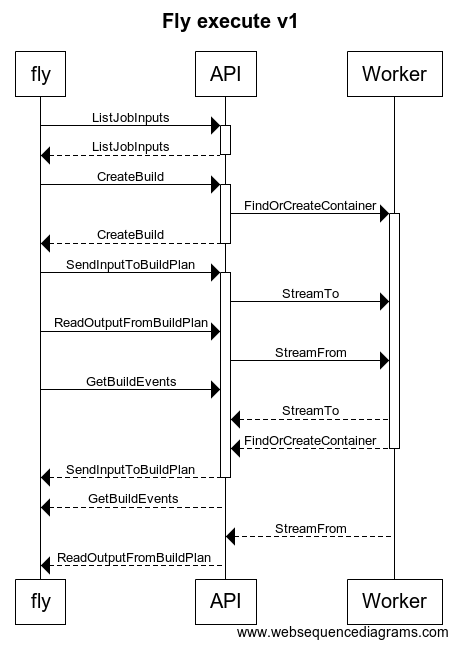
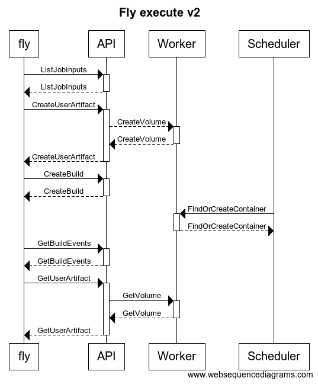

# user artifacts

## why?

Fly execute is weird, and involves API handlers that are coupled to the
runtime.

### Fly execute v1

1. Fly talks to ATC to determine a build plan
1. Fly asks the buildserver or pipelineserver (depending on presence of `-j`
   flag) to create a one-off build using the aforementioned plan
1. Fly opens a channel to upload its inputs to the buildserver 
1. Fly opens a channel to download its outputs from the buildserver
1. Fly waits for build events
1. Whichever server is tracking the build actually spins off a goroutine that
   runs it, and as the plan executes, it connects to the above channels to
   receive and send inputs and outputs

As illustrated in the diagram below, the last four steps overlap concurrently.

## what to do?

Create an artifactserver, handling the following endpoints:

1. `POST /api/v1/teams/:team/user-artifacts` to upload a folder to a volume
1. `GET /api/v1/teams/:team/user-artifacts/:uuid` to download the contents of a
   volume

Also modify the existing user-artifact build step to make use of these volumes
instead of the current implementation which involves forwarding connections to
the correct web node and orchestrating channels appropriately.

### Fly execute v2

1. Fly uploads inputs to artifactserver
1. Fly talks to ATC to determine a build plan
1. Fly asks the buildserver or jobserver to create a one-off build
1. The scheduler runs the build
1. Fly waits for build events
1. Fly downloads outputs from the artifactserver

## pros and cons

### pros

* the `fly execute` flow becomes easier to reason about
* the steps take place in a stateless sequence (i.e. any API node can handle
  any of the requests)
* each step has a single source of failure.
* buildserver and pipelineserver no longer have to be coupled to the runtime.
  They know nothing about the exec or worker packages, they just write things
  down and the scheduler asynchronously picks them up. This serves the broader
  'API maintenance' programme described in concourse/concourse#2739 and
  generally feels like a nice decoupled system.
* this approach opens the possibility of pursuing other features like
  concourse/concourse#963
* a fun side effect would be that you could run `fly execute` and go away, and
  then download the outputs of your build later.
* hopefully the resulting API design is more consistent: instead having the
  buildserver manage the unorthodox `SendInputToBuildPlan` and
  `ReadOutputFromBuildPlan` endpoints, these actions are described more
  uniformly by a new REST resource.

### cons

* we have some decisions to make around the lifecycle of these user-artifact
  volumes.
* it would, at least in the short term, introduce more complexity to the worker
  package.
* there are decisions to make about access control for user-artifact volumes

