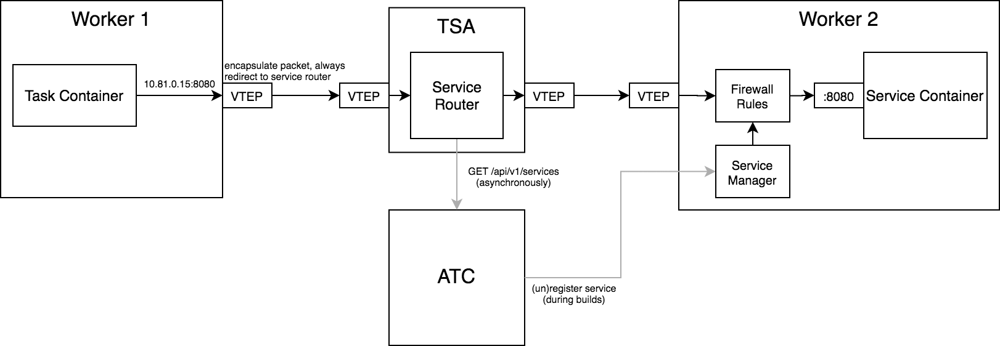

# Summary

Provide a native way to expose local services to steps.

# Motivation

* Easier integration testing ([concourse/concourse#324])
  * The current recommended way is to run a privileged `task` with a Docker daemon + `docker-compose` installed, and that task runs `docker-compose up` and the test suite

Possible anti-pattern: sharing state between steps

# Proposal

I propose adding a new `services` step modifier and special var source `.svc`, e.g.

```yaml
task: integration-tests
file: ci/tasks/test.yml
params:
  POSTGRES_ADDRESS: ((.svc:postgres.address))
  # or
  # POSTGRES_HOST: ((.svc:postgres.host))
  # POSTGRES_PORT: ((.svc:postgres.port))
  # 
  # to access addresses/ports other than the one named 'default', use:
  # ((.svc:postgres.addresses.some-port-name))
  # ((.svc:postgres.ports.some-port-name))
services:
- name: postgres
  file: ci/services/postgres.yml
```

When the step finishes (successfully or otherwise), the service will be gracefully terminated by first sending a `SIGTERM`, and eventually a `SIGKILL` if the service doesn't terminate within a timeout.

## Service Configuration

Services can be configured similarly to tasks, e.g.

```yaml
name: postgres
config: # or "file:"
  image_resource: # can specify a top-level "image:" instead of "image_resource:"
    type: registry-image
    source: {repository: postgres}
  inputs:
  - name: some-input
  ports:
  - name: default # optional if using default name
    number: 5432
  startup_probe: # By default, Concourse will wait for all the listed ports to be open
    run: {path: pg_isready}
    failure_threshold: 10
    period_seconds: 5
```

Services can also be configured as prototypes, similar to the `run` step, e.g.

```yaml
name: concourse
run: up
type: docker-compose
params:
  files:
  - concourse/docker-compose.yml
  - ci/overrides/docker-compose.ci-containerd.yml
inputs: [concourse, ci]
ports:
- name: web
  number: 8080
```

### Startup Probe

In order to ensure a service is ready to accept traffic before running any dependent steps, the `startup_probe` must first succeed.

If unspecified, Concourse will wait for each of the specified ports to be open (with some timeout).

A custom `startup_probe` can be defined that periodically runs a process on the service container until it succeeds (with some timeout).

## Sharing a service across multiple steps

To use a service in several steps, you can modify a `do`/`in_parallel` step:

```yaml
do:
- task: integration-suite-1
  ...
- task: integration-suite-2
  ...
services:
- name: app
  file: ci/services/my-app.yml
```

When used with an `across` step, however, each `across` step iteration will receive its own service. e.g.

```yaml
across:
- var: postgres_version
  values: [9, 10, 11, 12, 13]
task: integration-suite
file: ci/tasks/integration.yml
params:
  POSTGRES_ADDRESS: ((.svc:postgres.address))
services:
- name: postgres
  file: ci/services/postgres.yml
  image: postgres-((.:postgres_version))
```

...will spawn 5 postgres services. This behaviour can be avoided by wrapping the `across` step in a `do`, e.g.

```yaml
do:
- across: ...
  task: ...
services: ...
```

## Architecture

Below is a high-level overview of how this could be architected. Heads up - I almost certainly don't know what I'm talking about networking-wise, so please tell me where I'm speaking nonsense.



The packet-flow is as follows:

1. The step container sends a packet to the address provided by `((.svc:name.address))`.
    * Note: the host will be an IP address within a specific subnet dedicated to services
    * This can be changed depending on the runtime to circumvent the described packet flow as appropriate (e.g. in Kubernetes, Concourse can provide a DNS name to a Kubernetes service directly)
1. Since the packet is destined for an IP within the services subnet, it will be routed to a VXLAN network interface that encapsulates the packets and forwards to the TSA
1. A new component on the TSA - the [Service Router] - will determine which worker to route the packets to. It then re-encapsulates the packets and sends it back out over VXLAN
    * The [Service Router] can also perform access control to ensure containers can't communicate with services that they aren't exposed to
1. Firewall rules on the worker hosting the service will route the packets to the appropriate container's veth

Note: all of the worker <-> TSA traffic will flow through an SSH tunnel.

### Service Router

The Service Router is a new component on the TSA. It communicates with the ATC to get the list of services, and creates routing rules for each one.

### Service Manager

The Service Manager is a new component on each worker. When the ATC spins/tears down services, it will register/unregister the service with the host worker's Service Manager.

In response, the Service Manager will create/destroy internal routing rules (e.g. using `iptables`) to route traffic to the appropriate container.

# Open Questions

* I'm 90% sure the proposed architecture wouldn't work on Darwin/Windows workers - is VXLAN supported on these platforms? And if not, how can we share services with these workers?

# Answered Questions

# New Implications


[concourse/concourse#324](https://github.com/concourse/concourse/issues/324)
[Prototype]: https://github.com/concourse/rfcs/blob/master/037-prototypes/proposal.md
[Service Router]: #service-router
