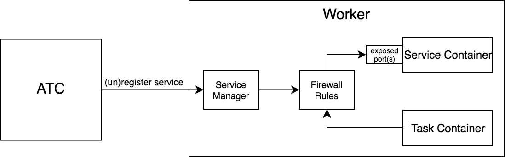

# Summary

Provide a native way to expose local services to steps.

# Motivation

* Easier integration testing ([concourse/concourse#324](https://github.com/concourse/concourse/issues/324))
  * The current recommended way is to run a privileged `task` with a Docker daemon + `docker-compose` installed, and that task runs `docker-compose up` and the test suite

# Proposal

I propose adding a new `services` field to the `task` step (and eventually `run` step) and special var source `.svc`, e.g.

```yaml
task: integration-tests
file: ci/tasks/test.yml
params:
  POSTGRES_ADDRESS: ((.svc:postgres.address))
  # or
  # POSTGRES_HOST: ((.svc:postgres.host))
  # POSTGRES_PORT: ((.svc:postgres.port))
  # 
  # Services can expose many ports, and each port is named.
  # To access addresses/ports other than the one named 'default', use:
  # ((.svc:postgres.addresses.some-port-name))
  # ((.svc:postgres.ports.some-port-name))
services:
- name: postgres
  file: ci/services/postgres.yml
```

When the `task` finishes (successfully or otherwise), the service will be gracefully terminated by first sending a `SIGTERM`, and eventually a `SIGKILL` if the service doesn't terminate within a timeout.

### With `across` step

Since `services` just binds to `task`, you can make use of the `across` step to run tests against a matrix of dependencies.

```yaml
across:
- var: postgres_version
  values: [9, 10, 11, 12, 13]
  max_in_flight: 3
task: integration-suite
file: ci/tasks/integration.yml
params:
  POSTGRES_ADDRESS: ((.svc:postgres.address))
services:
- name: postgres
  file: ci/services/postgres.yml
  image: postgres-((.:postgres_version))
```

## Service Configuration

Services can be configured similarly to tasks, e.g.

```yaml
name: postgres
config: # or "file:"
  image_resource: # can specify a top-level "image:" instead of "image_resource:"
    type: registry-image
    source: {repository: postgres}
  inputs:
  - name: some-input
  ports:
  - name: default # optional if using default name
    number: 5432
  startup_probe: # By default, Concourse will wait for all the listed ports to be open
    run: {path: pg_isready}
    failure_threshold: 10
    period_seconds: 5
```

Services can also run by sending a message to a [Prototype], similar to the `run` step, e.g.

```yaml
name: concourse
type: docker-compose
run: up
params:
  files:
  - concourse/docker-compose.yml
  - ci/overrides/docker-compose.ci-containerd.yml
inputs: [concourse, ci]
ports:
- name: web
  number: 8080
```

### Startup Probe

To ensure a service is ready to accept traffic before running the dependent step, the `startup_probe` must first succeed.

`startup_probe.run` defines a process to run on the service container until it succeeds. The process will run every `startup_probe.period_seconds`, and if it fails `startup_probe.failure_threshold` times, the service will error and the dependent step will not run.

If `startup_probe.run` is left unspecified, Concourse will wait for each of the specified ports to be open.

## Worker Placement

Since `services` are just bound to `task`s, the easiest approach would be to assign the service container and the task container to the same worker. This allows us to avoid a more complex architecture having to route traffic through the TSA (since workers may not be directly reachable from one another).

This hopefully isn't *too* restrictive, as anyone running e.g. `docker-compose` in a `task` for integration testing is effectively doing the same thing (just in one mega-container instead of 2+). It's also worth noting that with a native [Kubernetes Runtime], a single "worker" will likely correspond with an entire cluster, rather than a single node in the cluster.

However, it does mean that we can't provide services to tasks running on Windows/Darwin workers - not sure if there's much need for this, though.

## Networking

The way we accomplish intra-worker container-to-container networking depends on the runtime.

### Guardian and containerd

There are a couple of options here:

1. Containers on the same host can communicate via the bridge network (created by a CNI plugin in our [containerd backend], not sure about Guardian...)
    * Could work with minimal changes to the runtime layer
    * Need extra architecture to prevent a malicious `task` from scanning the container subnet to interfere with running services (note: it's currently possible for this to happen with any `task` that runs a server, e.g. running `docker-compose` in a `task`, but is easy to prevent with some changes to firewall rules)
2. With our containerd runtime, we have more flexibility, and have the option of running both processes in the same network namespace
    * This would allow communication over `localhost`
    * We'll need to wait until our containerd runtime is stable so we can replace it with Guardian
    * If a `task` has multiple services, two services cannot use the same ports (even if they are not exposed)

With respect to the second point under option 1, we *can* prevent such `tasks` if this is a concern by adding a Service Manager component to each worker to register/unregister services. This component could create/destroy firewall rules granting specific containers access to others.



### Kubernetes

When we build a [Kubernetes Runtime], we have a couple alternatives here as well that roughly mirror the choices for containerd:

1. Run the service as its own pod
    * Possible for service and `task` to run on different k8s nodes
    * I don't know enough about k8s to know whether it's possible to add firewall rules so that only the `task` pod can access the service pod
2. Run services as sidecar containers in the same pod as the `task`
    * Service and `task` must run on the same k8s node
    * If a `task` has multiple services, two services cannot use the same ports (even if they are not exposed)

# Open Questions

* Are there (sufficiently many) practical use-cases for exposing a service to multiple steps? Or is a single `task` always sufficient?
* Are there (sufficiently many) practical use-cases for exposing a service to a `task` on a Windows/Darwin worker?
* Would you ever need to run multiple services that both use the same port?

# Answered Questions

# New Implications


[Prototype]: https://github.com/concourse/rfcs/blob/master/037-prototypes/proposal.md
[Kubernetes Runtime]: https://github.com/concourse/rfcs/blob/075-k8s-runtime/075-k8s-runtime/proposal.md
[containerd backend]: https://github.com/concourse/concourse/blob/27e1d83fd3d24d22a1a8d9c83823d608fae63f4a/worker/runtime/cni_network.go#L66-L80
